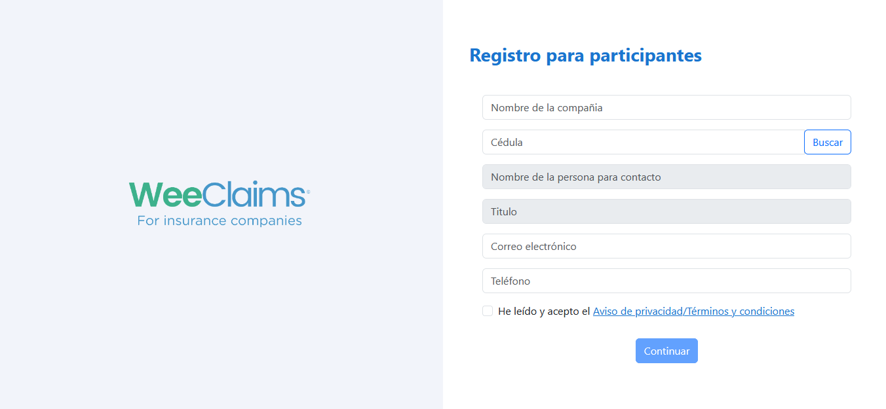
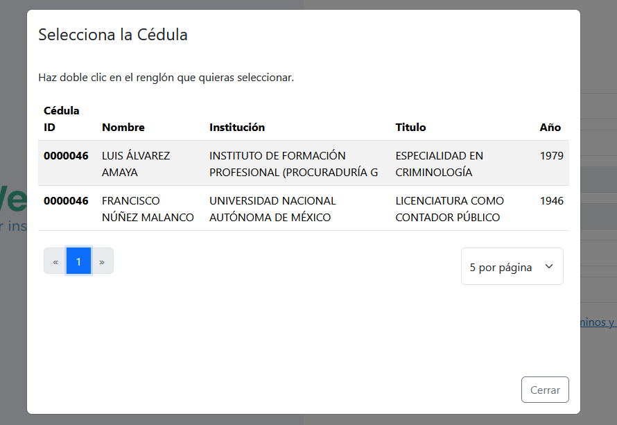
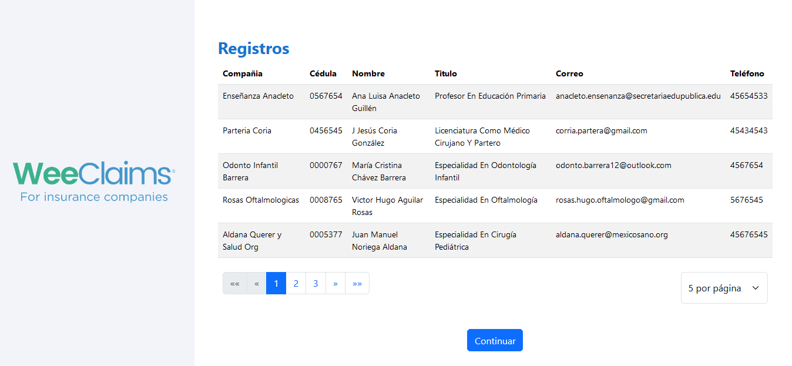
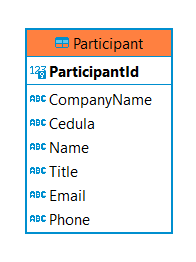

# cedula-profesional-app
Pequeña app de registro, que incluye un check de cedulas profesionales usando una solicitud a la instancia de gobierno pertinente,
y un registro para Particiapantes. 

## Descripción

Se uso la clean architecture para la organización del proyecto junto con el siguiente stack tegnológico:

* Angular 18
* .NET 7
* Sqlite3

## Pantallas

#### Pantalla de Inicio

#### Pantalla del modal de Cédulas

#### Pantalla de la tabla de participantes

#### Modelo de la Tabla Participant

